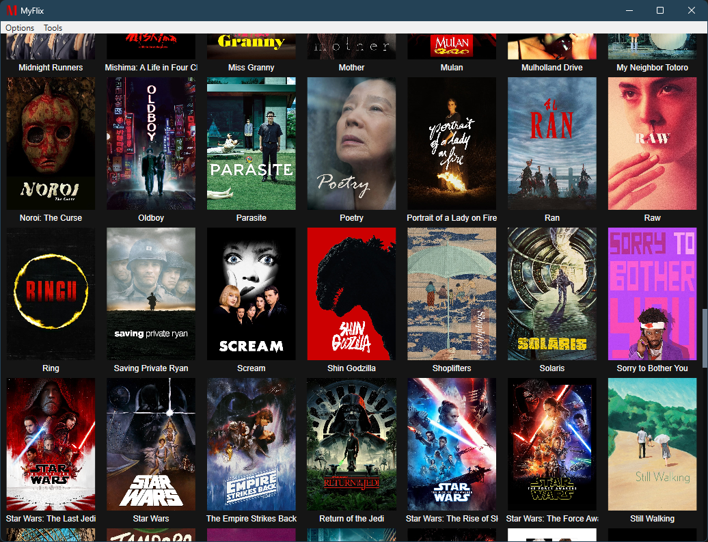
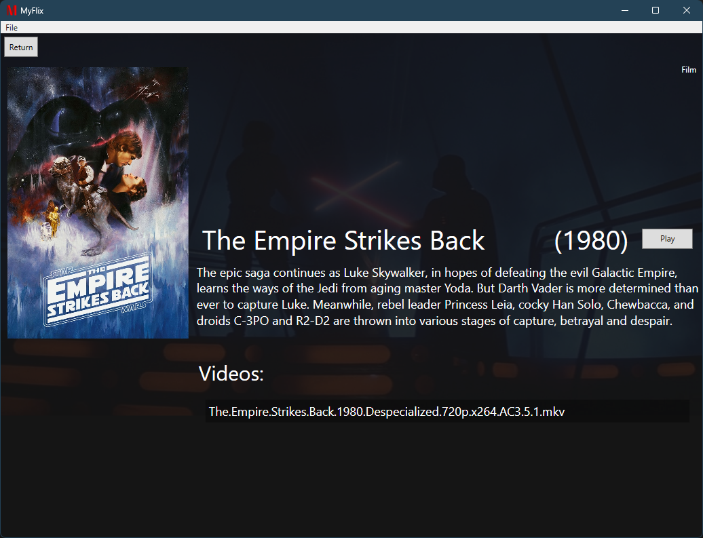
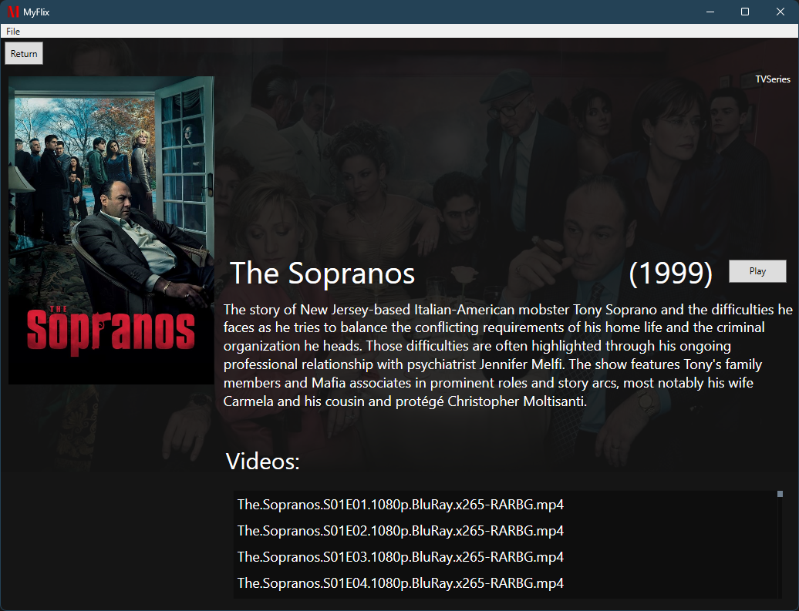

# MyFlix

A library management and video player desktop application for local TV shows and film video files. 

Made in C# .NET 6 and WPF, and using data from the TMDB API for media metadata lookups.

# Features

Given a root folder MyFlix searches for all video files recursively and adds them to a tile view for easy viewing.

The application automatically parses filenames to extract the title, and release year, and then uses API lookups to retrieve posters and descriptions. 

It remembers user watch progress within videos, and within a series for added convenience. 

Tools are provided to help manage media libary video files, including a regex bulk file naming tool, and an automatic search and exclusion of Extras/ Featurette content.

# Screenshots

